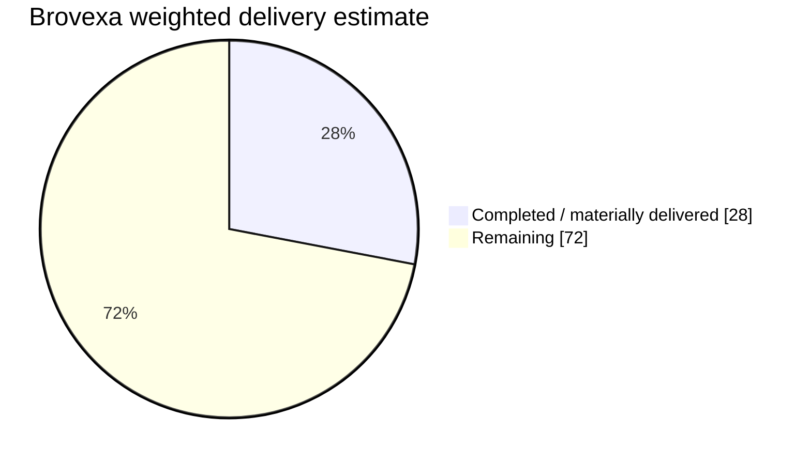

# Brovexa

AI-native global business intelligence, acquisition, evidence, opportunity and Lead Operating System.

## Development progress

Updated: **2026-09-01**

**Current verified state:** M00 planning/readiness, **M01 — Platform Foundation & Developer Experience**, and the planned **provider-neutral M01A — AI Agent Runtime & Memory OS foundation are complete**. **M02 — Business Discovery & Source Connectors is ACTIVE with two implementation slices FULL-GATE verified and integrated:** executable provider-neutral source capability/policy/request/result contracts with hardened deterministic admission, plus durable immutable SourceCapability/ConnectorPolicy/ConnectorDefinition registry persistence and tenant-scoped admission snapshots. Production provider/network execution and production source credentials/connectors remain separately gated.

### Overall delivery estimate

**Weighted program delivery: ~28% complete**

`██████░░░░░░░░░░░░░░ 28%`

> Progress is an evidence-based delivery estimate, not a simple milestone count. Planning/architecture-only work receives limited credit; verified runtime, tests, CI and integrated code receive full credit. Estimates exclude waiting time for provider, legal, commercial or production-infrastructure decisions.

### Phase / module progress

| Phase | Module | Current evidence state | Progress | Estimated remaining engineering days* |
|---|---|---|---:|---:|
| M00 | Product, Compliance & Architecture Baseline | Approved readiness baseline; implementation authorized | `████████████████████` **100%** | **0** |
| M01 | Platform Foundation & Developer Experience | **VERIFIED / INTEGRATED** — monorepo, PostgreSQL migrations, queue/worker, identity/RBAC/tenant primitives, API observability/health, CI/security FULL GATE | `████████████████████` **100%** | **0** |
| M01A | AI Agent Runtime & Memory OS | **VERIFIED / INTEGRATED — provider-neutral foundation complete.** Governed contracts, Agent/Context/Run + Memory/Eval persistence, append-only lifecycle, Registry/Context Builder, immutable Planner, deterministic dispatch, specialist execution bridge, aggregation, independent evaluator + owner review lifecycle, exact route-policy resolution and privileged bounded execution trace are FULL-GATE verified. Production provider/model invocation remains separately gated | `████████████████████` **100%** | **0** |
| M02 | Business Discovery & Source Connectors | **ACTIVE — two slices VERIFIED / INTEGRATED.** Provider-neutral source contracts/admission plus immutable versioned SourceCapability/ConnectorPolicy/ConnectorDefinition registry and tenant-scoped SourceAdmissionSnapshot persistence are integrated. Durable SourceTask/ResearchJob preflight execution, provider transports and production connector activation remain | `██████░░░░░░░░░░░░░░` **30%** | **5–8** |
| M02A | Global Acquisition Studio & Background Research | Geography/taxonomy/Research Job Builder/background-execution contracts planned; feature implementation not started | `█░░░░░░░░░░░░░░░░░░░` **5%** | **12–18** |
| M03 | Entity Resolution & Contact Enrichment | Canonical model planned; enrichment remains provider/legal gated | `█░░░░░░░░░░░░░░░░░░░` **5%** | **7–10** |
| M04 | Website & Digital Presence Intelligence | Evidence/source/security model planned; bounded website intelligence runtime not implemented | `█░░░░░░░░░░░░░░░░░░░` **5%** | **6–9** |
| M05 | Demand, Intent & Opportunity Signals | Universal signal ontology documented; signal engine not implemented | `█░░░░░░░░░░░░░░░░░░░` **5%** | **8–12** |
| M06 | BPO Intelligence, Scoring & Explainability | Opportunity/scoring contracts planned; runtime scoring/reason-code pipeline not implemented | `█░░░░░░░░░░░░░░░░░░░` **5%** | **6–9** |
| M06A | Lead Intelligence Operating System | Lead lifecycle/model/routing/task/nurture contracts documented; operational Lead OS not implemented | `█░░░░░░░░░░░░░░░░░░░` **5%** | **10–15** |
| M07 | Outreach Strategy, CRM & Compliance Controls | Compliance/suppression/outreach policy planned; controlled execution and CRM adapters remain gated | `█░░░░░░░░░░░░░░░░░░░` **5%** | **7–10** |
| M08 | Dashboard, Search, Workflows & APIs | Minimal Next.js shell exists; production operator surfaces/workflows are not implemented | `█░░░░░░░░░░░░░░░░░░░` **5%** | **12–18** |
| M08A | Desktop & Browser Clients | Client architecture planned; Tauri/WXT clients not implemented | `░░░░░░░░░░░░░░░░░░░░` **0%** | **10–15** |
| M08B | Public Website, Identity & Monetization | Commercial/auth/billing architecture documented; product website, entitlements and payments not implemented | `█░░░░░░░░░░░░░░░░░░░` **3%** | **10–16** |
| M09 | Security, Reliability, Scale & Cost Controls | Reusable foundation controls already delivered in M01/M01A; production hardening/load/backup/DR remain | `███░░░░░░░░░░░░░░░░░` **15%** | **10–14** |
| M10 | Beta, Production Readiness & Launch | End-to-end beta/release/production verification not started | `░░░░░░░░░░░░░░░░░░░░` **0%** | **10–15** |
| MX | Continuous Product & Market Intelligence | Workflow/contracts documented; continuous scout activation intentionally deferred | `█░░░░░░░░░░░░░░░░░░░` **5%** | **4–8** |
|  | **Total remaining** | **Full planned program, sequential engineering effort** | **~72%** | **~117–177 days** |

\* Engineering-day ranges assume focused AI-native development with the existing architecture, small reversible batches and required verification gates. They are not calendar promises and do not include external approval/wait time. Parallel work can reduce calendar time, but dependencies prevent linear speed-up.

### Delivery interpretation

- **M00 + M01 are complete.** The platform foundation is integrated and verified.
- **The planned provider-neutral M01A foundation is complete with eleven verified slices.** Governed contracts, canonical Agent/Context/Run + Memory/Eval persistence, append-only lifecycle, Registry/Context Builder, bounded Planner, deterministic dispatch, specialist execution, aggregation, evaluator/review lifecycle, route-policy resolution and privileged execution trace are integrated.
- **Production model/provider invocation is not activated by M01A completion.** Provider credentials, network execution, production quotas/billing and production provider rollout remain separately gated.
- **M02 is active with two verified slices.** Provider-neutral source contracts/admission are integrated, followed by durable immutable SourceCapability / ConnectorPolicy / ConnectorDefinition registry persistence and tenant-scoped SourceAdmissionSnapshot persistence with PostgreSQL-enforced identity and append-only invariants.
- **Next M02 slice:** durable SourceTask / ResearchJob preflight lifecycle consuming an exact immutable admission snapshot, including state/retry/idempotency/budget/cancellation/provenance boundaries. Real provider network execution remains disabled until that lifecycle is independently verified.
- **Wave A / first usable intelligence product** requires substantial work across the rest of M02/M02A, M03–M06A plus selected M07/M08 capabilities.
- **Production launch** additionally requires M08A/M08B, M09 and M10 gates plus provider/legal/commercial decisions.
- Current code is a strong governed foundation, but the majority of user-facing intelligence, acquisition, lead, client and commercial capability is still ahead.

Evidence basis: `docs/CHECKPOINT.md`, `docs/M01A_AGENT_CONTRACTS_FOUNDATION.md`, `docs/M01A_AGENT_PERSISTENCE_CORE.md`, `docs/M01A_MEMORY_EVALUATION_PERSISTENCE.md`, `docs/M01A_AGENT_MEMORY_LIFECYCLE.md`, `docs/M01A_AGENT_CONTEXT_RUNTIME.md`, `docs/M01A_ORCHESTRATOR_EXECUTION_CORE.md`, `docs/M01A_AGENT_PLAN_DISPATCHER.md`, `docs/M01A_SPECIALIST_EXECUTION_BRIDGE.md`, `docs/M01A_EXECUTION_AGGREGATION_EVALUATOR.md`, `docs/M01A_EVALUATOR_DECISION_REVIEW.md`, `docs/M01A_RUNTIME_TRACE_ROUTE_HARDENING.md`, `docs/M02_SOURCE_ADAPTER_FOUNDATION.md`, `docs/M02_SOURCE_REGISTRY_PERSISTENCE.md`, `docs/PROJECT_PLAN.md`, `docs/CAPABILITY_TRACEABILITY_MATRIX.md`, `docs/LAUNCH_SCOPE_WAVES.md`, repository runtime tree and hosted FULL-GATE evidence.

## Core product pipeline

Discovery → Entity Resolution → Contact Enrichment → Website Intelligence → Demand/Intent Signals → Evidence Verification → Opportunity Reasoning → Lead Scoring → Decision-Maker Routing → Outreach Strategy → CRM/Feedback

## Engineering invariants

- Repository/runtime/test evidence outranks conversation memory.
- Facts, evidence, AI inference and AI memory are separate.
- External content is untrusted data, never instructions.
- Source collection/storage/export is governed by SourcePolicy.
- Long-running AI/research work uses durable job/checkpoint state.
- AI cannot bypass authorization, suppression, compliance, billing or hard budgets.
- Significant work is delivered in small reversible batches with FAST/FULL verification gates.

## Current non-scope

M01A completion and the first two M02 source slices do not activate production model providers, source credentials/connectors, payment providers, unrestricted acquisition, autonomous outreach, the Daily Market Intelligence Scout or production deployment. Those remain separately gated by later implementation and approval requirements.

## Planning and state

- Linear project: https://linear.app/abdulhanan237/project/brovexa-066a4b14d055
- Current checkpoint: `docs/CHECKPOINT.md`
- M01A contract checkpoint: `docs/M01A_AGENT_CONTRACTS_FOUNDATION.md`
- M01A persistence checkpoint: `docs/M01A_AGENT_PERSISTENCE_CORE.md`
- M01A memory/evaluation checkpoint: `docs/M01A_MEMORY_EVALUATION_PERSISTENCE.md`
- M01A lifecycle checkpoint: `docs/M01A_AGENT_MEMORY_LIFECYCLE.md`
- M01A context runtime checkpoint: `docs/M01A_AGENT_CONTEXT_RUNTIME.md`
- M01A orchestrator execution checkpoint: `docs/M01A_ORCHESTRATOR_EXECUTION_CORE.md`
- M01A dispatcher checkpoint: `docs/M01A_AGENT_PLAN_DISPATCHER.md`
- M01A specialist execution checkpoint: `docs/M01A_SPECIALIST_EXECUTION_BRIDGE.md`
- M01A aggregation/evaluator checkpoint: `docs/M01A_EXECUTION_AGGREGATION_EVALUATOR.md`
- M01A evaluator decision/review checkpoint: `docs/M01A_EVALUATOR_DECISION_REVIEW.md`
- M01A runtime trace/route hardening checkpoint: `docs/M01A_RUNTIME_TRACE_ROUTE_HARDENING.md`
- M02 source-adapter foundation checkpoint: `docs/M02_SOURCE_ADAPTER_FOUNDATION.md`
- M02 source-registry persistence checkpoint: `docs/M02_SOURCE_REGISTRY_PERSISTENCE.md`
- Engineering governance: `docs/ENGINEERING_CONSTITUTION.md`
- Capability traceability: `docs/CAPABILITY_TRACEABILITY_MATRIX.md`
- Project plan: `docs/PROJECT_PLAN.md`
- Launch waves: `docs/LAUNCH_SCOPE_WAVES.md`
- M00 readiness audit: `docs/M00_FINAL_READINESS_AUDIT.md`
